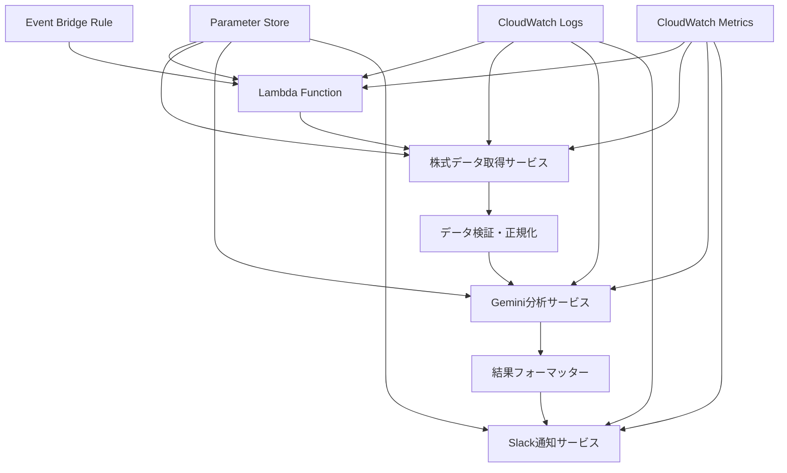

# 設計文書

## 概要

株式分析・通知アプリは、PythonベースのAWS Lambdaアプリケーションとして実装されます。このシステムは、株式データの取得、Gemini AI分析、Slack通知を自動化し、AWS Event Bridgeによる定期的なスケジュール実行をサポートします。

## アーキテクチャ

### システム構成



### 技術スタック

- **ランタイム**: AWS Lambda (Python 3.11)
- **言語**: Python
- **株式データAPI**: yfinance (Yahoo Finance) - 無料
- **AI分析**: Google Gemini API - 無料枠内で利用
- **通知**: Slack Webhook - 無料
- **スケジューリング**: AWS Event Bridge - 無料枠内
- **設定管理**: AWS Parameter Store + 環境変数 - 無料枠内
- **ログ**: AWS CloudWatch Logs - 無料枠内
- **メトリクス**: AWS CloudWatch Metrics - 無料枠内
- **HTTP クライアント**: requests
- **AWS SDK**: boto3

### コスト最適化設計

**月間推定コスト: $0-2**
- Lambda実行: $0 (無料枠内)
- CloudWatch: $0 (無料枠内)
- Parameter Store: $0 (無料枠内)
- Event Bridge: $0 (無料枠内)
- 外部API: $0 (無料枠内で制限管理)

**API制限管理:**
- yfinance: レート制限を遵守
- Gemini API: 月15リクエスト以内に制限
- Google Sheets API: 日100リクエスト以内に制限

## コンポーネントと インターフェース

### 1. 設定管理 (ConfigManager)

```python
from dataclasses import dataclass
from typing import List, Optional

@dataclass
class StockConfig:
    symbol: str
    name: str
    quantity: int
    purchase_price: Optional[float] = None

@dataclass
class WatchlistStock:
    symbol: str
    name: str

@dataclass
class GoogleSheetsConfig:
    spreadsheet_id: str
    holdings_sheet_name: str = "保有銘柄"
    watchlist_sheet_name: str = "ウォッチリスト"
    credentials_path: str = "credentials.json"

@dataclass
class GeminiConfig:
    api_key: str
    model: str = "gemini-pro"

@dataclass
class SlackConfig:
    webhook_url: str
    channel: str

@dataclass
class AppConfig:
    stocks: List[StockConfig]
    watchlist: List[WatchlistStock]
    google_sheets: GoogleSheetsConfig
    gemini: GeminiConfig
    slack: SlackConfig
```

**責任**:
- AWS Parameter Storeからの設定読み込み
- Google Sheets設定の管理
- 環境変数の管理
- 設定の検証とデフォルト値の提供

### 1.5. Google Sheets統合サービス (GoogleSheetsService)

```python
from googleapiclient.discovery import build
from google.oauth2.service_account import Credentials

class GoogleSheetsService:
    def __init__(self, config: GoogleSheetsConfig):
        self.config = config
        self.service = self._build_service()
    
    def _build_service(self):
        """Google Sheets APIサービスを構築"""
        pass
    
    def fetch_holdings(self) -> List[StockConfig]:
        """保有銘柄シートから銘柄情報を取得"""
        pass
    
    def fetch_watchlist(self) -> List[WatchlistStock]:
        """ウォッチリストシートから監視銘柄を取得"""
        pass
    
    def validate_sheet_structure(self, sheet_name: str) -> bool:
        """シート構造の妥当性を検証"""
        pass
```

**責任**:
- Google Sheets APIとの通信
- 保有銘柄とウォッチリストの取得
- シートデータの検証と正規化
- 認証情報の管理

### 2. 株式データサービス (StockDataService)

```python
from dataclasses import dataclass
from datetime import datetime
from typing import List

@dataclass
class StockData:
    symbol: str
    current_price: float
    previous_close: float
    change: float
    change_percent: float
    volume: int
    timestamp: datetime
    # 履歴データ（テクニカル分析用）
    price_history: Optional[List[float]] = None
    volume_history: Optional[List[int]] = None

class StockDataService:
    def fetch_stock_data(self, symbols: List[str]) -> List[StockData]:
        """外部APIから株式データを取得"""
        pass
    
    def fetch_historical_data(self, symbols: List[str], period: str) -> List[StockData]:
        """履歴データを取得（テクニカル分析用）"""
        pass
    
    def validate_data(self, data: List[StockData]) -> bool:
        """データの妥当性を検証"""
        pass
```

**責任**:
- 外部APIからの株式データ取得
- 履歴データの取得（テクニカル分析用）
- データの検証と正規化
- レート制限の管理
- CloudWatchメトリクスの送信

### 2.5. テクニカル指標計算サービス (TechnicalIndicatorService)

```python
class TechnicalIndicatorService:
    def calculate_moving_averages(self, prices: List[float], short_period: int = 25, long_period: int = 75) -> tuple:
        """移動平均線を計算"""
        pass
    
    def detect_golden_dead_cross(self, short_ma: float, long_ma: float, prev_short_ma: float, prev_long_ma: float) -> tuple:
        """ゴールデンクロス/デッドクロスを検出"""
        pass
    
    def detect_breakouts(self, current_price: float, price_history: List[float], period: int = 20) -> dict:
        """新高値/新安値ブレイクを検出"""
        pass
    
    def calculate_support_resistance(self, price_history: List[float]) -> dict:
        """サポート・レジスタンスラインを計算"""
        pass
    
    def calculate_rsi(self, prices: List[float], period: int = 14) -> float:
        """RSIを計算"""
        pass
    
    def calculate_macd(self, prices: List[float]) -> dict:
        """MACDを計算"""
        pass
    
    def calculate_market_correlation(self, stock_prices: List[float], market_prices: List[float]) -> float:
        """市場との相関係数を計算"""
        pass
    
    def calculate_volume_change_rate(self, current_volume: int, volume_history: List[int]) -> float:
        """出来高変化率を計算"""
        pass
```

**責任**:
- 各種テクニカル指標の計算
- トレンド分析とシグナル検出
- 統計的指標の算出
- 指標の解釈とシグナル生成

### 3. Gemini分析サービス (AnalysisService)

```python
from enum import Enum

class AnalysisType(Enum):
    DAILY = "daily"
    WEEKLY = "weekly"
    MONTHLY = "monthly"

@dataclass
class TechnicalIndicators:
    golden_cross: bool
    dead_cross: bool
    new_high_break: bool
    new_low_break: bool
    resistance_break: bool
    support_break: bool
    rsi: float
    macd_signal: str
    market_correlation: float
    volume_change_rate: float

@dataclass
class AnalysisRequest:
    analysis_type: AnalysisType
    stock_data: List[StockData]
    portfolio_context: 'PortfolioContext'
    technical_indicators: Optional[TechnicalIndicators] = None
    market_context: Optional['MarketContext'] = None

@dataclass
class AnalysisResult:
    analysis_type: AnalysisType
    summary: str
    recommendations: List['Recommendation']
    risk_assessment: 'RiskAssessment'
    market_outlook: str
    timestamp: datetime

class AnalysisService:
    def analyze_daily(self, request: AnalysisRequest) -> AnalysisResult:
        """日次分析：テクニカル指標に基づく売買推奨"""
        pass
    
    def analyze_weekly(self, request: AnalysisRequest) -> AnalysisResult:
        """週次分析：保有株式のパフォーマンス分析"""
        pass
    
    def analyze_monthly(self, request: AnalysisRequest) -> AnalysisResult:
        """月次分析：国・業種別分析とリバランス提案"""
        pass
    
    def format_prompt(self, analysis_type: AnalysisType, data: List[StockData]) -> str:
        """分析タイプ別のプロンプトを生成"""
        pass
```

**責任**:
- Gemini APIとの通信
- 分析タイプ別のプロンプト生成
- テクニカル指標の計算と評価
- 結果の構造化
- API呼び出しのログ記録

### 4. Slack通知サービス (NotificationService)

```python
@dataclass
class SlackMessage:
    channel: str
    text: str
    blocks: Optional[List[dict]] = None
    attachments: Optional[List[dict]] = None

class NotificationService:
    def send_analysis_result(self, result: AnalysisResult) -> None:
        """分析結果をSlackに送信"""
        pass
    
    def send_error_notification(self, error: Exception) -> None:
        """エラー通知をSlackに送信"""
        pass
    
    def format_message(self, result: AnalysisResult) -> SlackMessage:
        """分析結果をSlackメッセージ形式にフォーマット"""
        pass
```

**責任**:
- Slack Webhook APIとの通信
- メッセージフォーマットの管理
- 通知の優先度管理
- 送信結果のログ記録

### 5. Lambda ハンドラー (LambdaHandler)

```python
import json
from typing import Dict, Any

class LambdaHandler:
    def __init__(self):
        self.config_manager = ConfigManager()
        self.stock_service = StockDataService()
        self.analysis_service = AnalysisService()
        self.notification_service = NotificationService()
    
    def lambda_handler(self, event: Dict[str, Any], context: Any) -> Dict[str, Any]:
        """Lambda関数のメインハンドラー"""
        pass
    
    def execute_analysis(self) -> None:
        """株式分析の実行"""
        pass
```

**責任**:
- Event Bridgeイベントの処理
- 各サービスの協調実行
- エラーハンドリングと復旧
- CloudWatchへのメトリクス送信

## データモデル

### 株式データモデル

```python
@dataclass
class Portfolio:
    stocks: List['StockHolding']
    total_value: float
    total_change: float
    total_change_percent: float
    last_updated: datetime

@dataclass
class StockHolding:
    config: StockConfig
    data: StockData
    current_value: float
    unrealized_gain_loss: Optional[float] = None
    unrealized_gain_loss_percent: Optional[float] = None
```

### 分析結果モデル

```python
from enum import Enum

class RecommendationType(Enum):
    BUY = "BUY"
    SELL = "SELL"
    HOLD = "HOLD"

class RiskLevel(Enum):
    LOW = "LOW"
    MEDIUM = "MEDIUM"
    HIGH = "HIGH"

@dataclass
class Recommendation:
    type: RecommendationType
    symbol: str
    confidence: float
    reasoning: str
    target_price: Optional[float] = None

@dataclass
class RiskAssessment:
    overall_risk: RiskLevel
    diversification_score: float
    volatility_analysis: str
    recommendations: List[str]
```

## エラーハンドリング

### エラー分類

1. **一時的エラー**: ネットワーク障害、API制限
   - 指数バックオフによる再試行
   - 最大3回の再試行

2. **設定エラー**: 無効な設定、認証失敗
   - デフォルト値の使用
   - 管理者への通知

3. **致命的エラー**: システム障害、メモリ不足
   - 安全なシャットダウン
   - 緊急通知の送信

### エラー処理戦略

```python
import logging
import time
from typing import Callable, TypeVar, Any

T = TypeVar('T')

class ErrorHandler:
    def handle_api_error(self, error: Exception) -> None:
        """API関連エラーの処理"""
        pass
    
    def handle_config_error(self, error: Exception) -> None:
        """設定関連エラーの処理"""
        pass
    
    def handle_critical_error(self, error: Exception) -> None:
        """致命的エラーの処理"""
        pass

class RetryPolicy:
    def __init__(self, max_retries: int = 3, base_delay: float = 1.0, max_delay: float = 10.0):
        self.max_retries = max_retries
        self.base_delay = base_delay
        self.max_delay = max_delay
    
    def execute_with_retry(self, operation: Callable[[], T]) -> T:
        """指数バックオフによるリトライ実行"""
        pass
```

## テスト戦略

### 単体テスト
- 各サービスクラスの個別機能テスト
- モックを使用した外部API依存の分離
- エラーハンドリングのテスト

### 統合テスト
- API統合の動作確認
- 設定ファイルの読み込みテスト
- エンドツーエンドのワークフローテスト

### テストツール
- **テストフレームワーク**: pytest
- **モック**: unittest.mock
- **カバレッジ**: pytest-cov

### テスト環境
- 開発環境用のテスト設定
- モックAPIサーバーの使用
- テスト用Slackチャンネルの設定

## セキュリティ考慮事項

### API キー管理
- 環境変数による機密情報の管理
- .env ファイルの .gitignore 登録
- 本番環境での安全な秘密情報管理

### データ保護
- 株式データの一時的な保存のみ
- 個人情報の最小限の取り扱い
- ログでの機密情報のマスキング

## パフォーマンス最適化

### API呼び出し最適化
- バッチでの株式データ取得
- レート制限の遵守
- キャッシュ戦略の実装

### メモリ管理
- 大量データの適切な処理
- ガベージコレクションの考慮
- メモリリークの防止

## 運用監視

### ログ戦略
- CloudWatch Logsによる構造化ログ
- ログレベルの適切な設定（INFO、WARNING、ERROR）
- Lambda関数の実行ログの自動収集

### CloudWatchメトリクス
- カスタムメトリクスの送信
- API応答時間の記録
- エラー発生率の監視
- 通知送信成功率の追跡

### 監視項目
- Lambda関数の実行時間と成功率
- 外部API（株式データ、Gemini、Slack）の応答時間
- エラー発生率とエラータイプ別の分類
- 通知送信の成功率
- メモリ使用量とタイムアウト発生率

### アラート設定
- 連続するエラー発生時のアラート
- API応答時間の異常値検知
- Lambda関数のタイムアウト監視

## AWS リソース構成

### Lambda関数
- **ランタイム**: Python 3.11
- **メモリ**: 512MB（Gemini API呼び出しを考慮）
- **タイムアウト**: 5分
- **環境変数**: ログレベル、リージョン設定

### Event Bridge
- **日次スケジュール**: 平日の市場終了後に実行
  - **Cron式**: `0 22 ? * MON-FRI *` (22時、市場終了後)
- **週次スケジュール**: 毎週金曜日の夜に実行
  - **Cron式**: `0 23 ? * FRI *` (金曜日23時)
- **月次スケジュール**: 毎月最終営業日の夜に実行
  - **Cron式**: `0 23 L * ? *` (月末23時)
- **ターゲット**: Lambda関数（分析タイプをイベントで指定）

### Parameter Store
- **設定パラメータ**:
  - `/stock-analysis/google-sheets-id` - Google Spreadsheet ID
  - `/stock-analysis/google-credentials` - Google Sheets API認証情報（SecureString）
  - `/stock-analysis/gemini-api-key` - Gemini APIキー（SecureString）
  - `/stock-analysis/slack-webhook` - Slack Webhook URL（SecureString）

### IAM ロール
- **Lambda実行ロール**:
  - CloudWatch Logs書き込み権限
  - Parameter Store読み取り権限
  - CloudWatch Metrics書き込み権限
  - Google Sheets API呼び出し権限（サービスアカウント経由）

## CI/CD戦略

### GitHub Actions CI/CD

**選択理由**: 完全無料、AWS SAMとの優秀な統合、豊富なアクション

#### メインワークフロー
```yaml
# .github/workflows/deploy.yml
name: Deploy Stock Analysis App

on:
  push:
    branches: [main, develop]
  pull_request:
    branches: [main]

env:
  AWS_REGION: ap-northeast-1
  PYTHON_VERSION: '3.11'

jobs:
  test:
    runs-on: ubuntu-latest
    steps:
      - name: Checkout code
        uses: actions/checkout@v4
      
      - name: Set up Python
        uses: actions/setup-python@v4
        with:
          python-version: ${{ env.PYTHON_VERSION }}
      
      - name: Cache dependencies
        uses: actions/cache@v3
        with:
          path: ~/.cache/pip
          key: ${{ runner.os }}-pip-${{ hashFiles('**/requirements.txt') }}
      
      - name: Install dependencies
        run: |
          pip install -r requirements.txt
          pip install pytest pytest-cov pytest-mock
      
      - name: Run linting
        run: |
          pip install flake8 black
          flake8 src tests
          black --check src tests
      
      - name: Run tests with coverage
        run: |
          pytest --cov=src --cov-report=xml --cov-report=term tests/
      
      - name: Upload coverage to Codecov
        uses: codecov/codecov-action@v3
        with:
          file: ./coverage.xml

  deploy-staging:
    needs: test
    runs-on: ubuntu-latest
    if: github.ref == 'refs/heads/develop'
    environment: staging
    steps:
      - name: Checkout code
        uses: actions/checkout@v4
      
      - name: Set up Python
        uses: actions/setup-python@v4
        with:
          python-version: ${{ env.PYTHON_VERSION }}
      
      - name: Set up AWS SAM
        uses: aws-actions/setup-sam@v2
      
      - name: Configure AWS credentials
        uses: aws-actions/configure-aws-credentials@v4
        with:
          aws-access-key-id: ${{ secrets.AWS_ACCESS_KEY_ID }}
          aws-secret-access-key: ${{ secrets.AWS_SECRET_ACCESS_KEY }}
          aws-region: ${{ env.AWS_REGION }}
      
      - name: Build SAM application
        run: sam build
      
      - name: Deploy to staging
        run: |
          sam deploy \
            --config-env staging \
            --no-confirm-changeset \
            --no-fail-on-empty-changeset

  deploy-production:
    needs: test
    runs-on: ubuntu-latest
    if: github.ref == 'refs/heads/main'
    environment: production
    steps:
      - name: Checkout code
        uses: actions/checkout@v4
      
      - name: Set up Python
        uses: actions/setup-python@v4
        with:
          python-version: ${{ env.PYTHON_VERSION }}
      
      - name: Set up AWS SAM
        uses: aws-actions/setup-sam@v2
      
      - name: Configure AWS credentials
        uses: aws-actions/configure-aws-credentials@v4
        with:
          aws-access-key-id: ${{ secrets.AWS_ACCESS_KEY_ID_PROD }}
          aws-secret-access-key: ${{ secrets.AWS_SECRET_ACCESS_KEY_PROD }}
          aws-region: ${{ env.AWS_REGION }}
      
      - name: Build SAM application
        run: sam build
      
      - name: Deploy to production
        run: |
          sam deploy \
            --config-env production \
            --no-confirm-changeset \
            --no-fail-on-empty-changeset
      
      - name: Notify Slack on success
        if: success()
        uses: 8398a7/action-slack@v3
        with:
          status: success
          text: '🚀 Stock Analysis App deployed successfully to production!'
        env:
          SLACK_WEBHOOK_URL: ${{ secrets.SLACK_WEBHOOK_URL }}
      
      - name: Notify Slack on failure
        if: failure()
        uses: 8398a7/action-slack@v3
        with:
          status: failure
          text: '❌ Stock Analysis App deployment failed!'
        env:
          SLACK_WEBHOOK_URL: ${{ secrets.SLACK_WEBHOOK_URL }}
```

#### 必要なGitHub Secrets
```
AWS_ACCESS_KEY_ID          # ステージング用AWSアクセスキー
AWS_SECRET_ACCESS_KEY      # ステージング用AWSシークレットキー
AWS_ACCESS_KEY_ID_PROD     # 本番用AWSアクセスキー
AWS_SECRET_ACCESS_KEY_PROD # 本番用AWSシークレットキー
SLACK_WEBHOOK_URL          # デプロイ通知用Slack Webhook
```

### 推奨CI/CDフロー

1. **開発フロー**:
   ```
   開発 → コミット → プルリクエスト → 自動テスト → レビュー → マージ → 自動デプロイ
   ```

2. **環境戦略**:
   - **開発環境**: ローカル開発 + モック
   - **ステージング環境**: AWS Lambda（テスト用）
   - **本番環境**: AWS Lambda（本番用）

3. **デプロイ戦略**:
   - **Blue/Green デプロイ**: Lambda Aliasを使用
   - **ロールバック**: 前バージョンへの即座切り替え
   - **カナリアデプロイ**: 段階的なトラフィック移行

### セキュリティ考慮事項

1. **シークレット管理**:
   - GitHub Secrets / GitLab Variables
   - AWS Parameter Store連携
   - 環境別の設定分離

2. **権限管理**:
   - 最小権限の原則
   - IAMロールベースのデプロイ
   - 一時的な認証情報の使用

### 監視とアラート

1. **デプロイ監視**:
   - CloudWatch Logsでのデプロイ状況確認
   - Lambda関数の健全性チェック
   - 自動ロールバック機能

2. **通知設定**:
   - デプロイ成功/失敗のSlack通知
   - テスト失敗時の開発者通知
   - 本番エラー時の緊急アラート

### ブランチ戦略

```
main (本番)     ←── プルリクエスト ←── develop (ステージング)
                                        ↑
                                   feature/xxx (機能開発)
```

- **feature/xxx**: 機能開発ブランチ
- **develop**: ステージング環境（自動デプロイ）
- **main**: 本番環境（自動デプロイ + 承認）

### セキュリティとベストプラクティス

1. **環境分離**:
   - ステージング環境と本番環境の完全分離
   - 異なるAWS認証情報の使用
   - 環境別のParameter Store設定

2. **コード品質**:
   - 自動リンティング（flake8, black）
   - テストカバレッジ測定
   - プルリクエスト必須

3. **デプロイ安全性**:
   - 本番デプロイ前の承認機能
   - 自動ロールバック機能
   - デプロイ状況のSlack通知

### 開発戦略

#### ローカル開発環境

**1. プロジェクト構造**
```
stock-analysis-notification/
├── src/
│   ├── __init__.py
│   ├── main.py                 # ローカル実行用
│   ├── lambda_function.py      # Lambda エントリーポイント
│   ├── config/
│   │   └── config_manager.py
│   ├── services/
│   │   ├── stock_data_service.py
│   │   ├── analysis_service.py
│   │   └── notification_service.py
│   └── models/
│       └── data_models.py
├── tests/
├── events/                     # テスト用イベントファイル
├── template.yaml              # SAM テンプレート
├── pyproject.toml
├── requirements.txt
└── .env.example
```

**2. 開発フロー**
```
1. ローカル開発 → 2. ユニットテスト → 3. SAM Local テスト → 4. デプロイ → 5. 統合テスト
```

**3. 環境設定**
```python
# .env.local (ローカル開発用)
ENVIRONMENT=local
LOG_LEVEL=DEBUG
GOOGLE_SHEETS_ID=your_test_sheet_id
GEMINI_API_KEY=your_test_api_key
SLACK_WEBHOOK_URL=your_test_webhook
```

#### 段階的実装戦略

**Phase 1: コア機能をローカルで開発**
- データモデルの実装
- 基本的なサービスクラス
- ユニットテストの作成
- ローカルでの動作確認

**Phase 2: AWS統合の準備**
- 設定管理（Parameter Store対応）
- エラーハンドリング
- ログ機能の実装

**Phase 3: Lambda統合**
- Lambda関数の作成
- SAM Localでのテスト
- 初回デプロイ

**Phase 4: 本格運用**
- CI/CDパイプライン
- 監視・アラート設定
- 本番デプロイ

#### 開発環境セットアップ

**1. Python仮想環境の作成**
```bash
# プロジェクトディレクトリに移動
cd stock-analysis-notification

# Python仮想環境を作成
python -m venv venv

# 仮想環境を有効化
# Windows (Command Prompt)
venv\Scripts\activate

# Windows (PowerShell)
venv\Scripts\Activate.ps1

# macOS/Linux
source venv/bin/activate

# 仮想環境が有効化されていることを確認
which python  # macOS/Linux
where python   # Windows
```

**2. 依存関係のインストール**
```bash
# 本番用依存関係
pip install -r requirements.txt

# 開発用依存関係（オプション）
pip install -e ".[dev]"  # pyproject.tomlを使用する場合

# または個別インストール
pip install pytest pytest-cov pytest-mock
pip install black flake8 mypy
pip install python-dotenv
```

**3. AWS SAM CLIのインストール**
```bash
# pip経由でインストール
pip install aws-sam-cli

# インストール確認
sam --version
```

**4. 環境設定ファイルの作成**
```bash
# 環境設定ファイルをコピー
cp .env.example .env.local

# .env.localを編集（実際の値を設定）
```

**5. 開発用スクリプト**
```bash
# setup.sh (macOS/Linux用)
#!/bin/bash
echo "🚀 開発環境をセットアップ中..."

# 仮想環境作成
python -m venv venv
source venv/bin/activate

# 依存関係インストール
pip install --upgrade pip
pip install -r requirements.txt
pip install pytest pytest-cov black flake8

# AWS SAM CLI
pip install aws-sam-cli

echo "✅ セットアップ完了！"
echo "仮想環境を有効化するには: source venv/bin/activate"
```

```batch
REM setup.bat (Windows用)
@echo off
echo 🚀 開発環境をセットアップ中...

REM 仮想環境作成
python -m venv venv
call venv\Scripts\activate.bat

REM 依存関係インストール
pip install --upgrade pip
pip install -r requirements.txt
pip install pytest pytest-cov black flake8

REM AWS SAM CLI
pip install aws-sam-cli

echo ✅ セットアップ完了！
echo 仮想環境を有効化するには: venv\Scripts\activate.bat
```

**6. 日常的な開発コマンド**
```bash
# 仮想環境有効化（毎回必要）
source venv/bin/activate  # macOS/Linux
venv\Scripts\activate     # Windows

# ローカル実行
python src/main.py

# テスト実行
pytest tests/ -v

# コードフォーマット
black src tests

# リンティング
flake8 src tests

# 型チェック
mypy src

# SAM Localでテスト
sam local invoke StockAnalysisFunction --event events/daily-analysis.json

# 仮想環境無効化
deactivate
```

**7. 便利なMakefile（オプション）**
```makefile
# Makefile
.PHONY: setup install test lint format run clean deploy

# 初回セットアップ
setup:
	python -m venv venv
	@echo "仮想環境を有効化してください: source venv/bin/activate (Linux/Mac) または venv\\Scripts\\activate (Windows)"

# 依存関係インストール
install:
	pip install --upgrade pip
	pip install -r requirements.txt
	pip install pytest pytest-cov black flake8 mypy aws-sam-cli

# テスト実行
test:
	pytest tests/ -v --cov=src

# リンティング
lint:
	flake8 src tests
	mypy src

# コードフォーマット
format:
	black src tests

# ローカル実行
run:
	python src/main.py

# SAM Localテスト
sam-local:
	sam local invoke StockAnalysisFunction --event events/daily-analysis.json

# クリーンアップ
clean:
	find . -type d -name "__pycache__" -delete
	find . -type f -name "*.pyc" -delete
	rm -rf .pytest_cache
	rm -rf .coverage

# デプロイ
deploy:
	sam build
	sam deploy --guided

# 開発用コマンド（テスト + リント + フォーマット）
dev: format lint test
	@echo "✅ 開発チェック完了"
```

**使用例:**
```bash
# 初回セットアップ
make setup
source venv/bin/activate  # 仮想環境有効化
make install

# 日常的な開発
make dev      # フォーマット + リント + テスト
make run      # ローカル実行
make sam-local # SAM Localテスト
```

**VS Code拡張（推奨）:**
- AWS Toolkit
- Python
- Pylance
- GitLens
- Python Docstring Generator

#### テスト戦略

**1. ローカルテスト**
```python
# tests/test_stock_service.py
import pytest
from unittest.mock import Mock, patch
from src.services.stock_data_service import StockDataService

class TestStockDataService:
    def test_fetch_stock_data_success(self):
        service = StockDataService()
        # モックを使用したテスト
        with patch('yfinance.download') as mock_download:
            mock_download.return_value = Mock()
            result = service.fetch_stock_data(['AAPL'])
            assert result is not None
```

**2. SAM Localテスト**
```bash
# イベントファイルを使用したテスト
sam local invoke -e events/daily-analysis.json
```

**3. 統合テスト**
```python
# tests/integration/test_lambda_integration.py
def test_lambda_handler_integration():
    """実際のLambda環境での統合テスト"""
    pass
```

### コスト最適化

**月間開発・運用コスト: $0**
- GitHub Actions: 無料枠内（月2,000分）
- AWS Lambda: 無料枠内（月100万リクエスト）
- CloudWatch: 無料枠内
- SAM Local: 完全無料
- 開発ツール: 全て無料